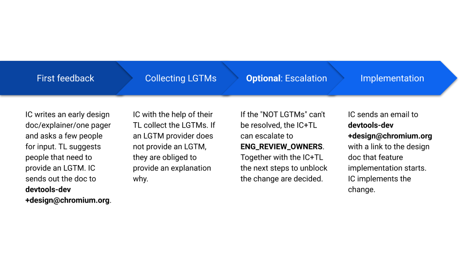

# Chrome DevTools Design Review Guidelines

When contributing to Chrome DevTools, please follow the process explained in this document. This is to reach a clear agreement on proposals, while involving all relevant stakeholders and decision makers.

This process puts the IC in charge, but also requires Chrome DevTools' leaders to help the IC navigate the decision process. It includes an escalation path in case of disagreement. The overhead of this process should be proportionate to the scope of the proposal.

**Important:**

1. Assume good intentions.
1. Be kind and civilized.
1. Be pragmatic.

## Roles

### Individual Contributor (IC)

_LGTM_: N/A

This person is the creator of the feature and the creator of the design documentation.

### Technical Lead (TL)

_LGTM_: Required. May delegate.

The Chrome DevTools TL is Danil Somsikov (dsv@chromium.org). The TL ensures architectural consistency and good coverage by the right set of LGTM providers, and is required to sign off on the design. They may however explicitly delegate to other LGTM providers.

In the absence of the TL, an EnReOw can act in their stead.

### LGTM provider

_LGTM_: Required. May delegate.

This is a person that is required to give LGTM. These are usually ICs with significant knowledge about the areas in question.

### Reviewer

_LGTM_: Not required.

This is somebody who reviews and comments on the proposal. Their input should be considered, although their LGTM is not required.

### The Eng Review Owners (EnReOw)

_LGTM_: Not required. However, LGTM or non-LGTM is binding.

Stuck proposals can be escalated to the [ENG_REVIEW_OWNERS](https://cs.chromium.org/chromium/src/third_party/devtools-frontend/src/config/owner/ENG_REVIEW_OWNERS). Potential use cases of such an escalation:

- An LGTM provider is non-responsive.
- No consensus on the design can be reached.

The EnReOw can overrule non-LGTMs or LGTMs.

## Detailed workflow

1. IC shares the document with LGTM providers and reviewers according to the roles listed above.
1. LGTM providers may add more LGTM providers to remove themselves as LGTM providers.
1. LGTM providers and reviewers review the design document and add feedback.
1. IC incorporates feedback and iterates on their design document.
1. Optional: the design doc is shared publicly with devtools-dev+design@chromium.org (make sure to give comment access to contributors@chromium.org, but untick the "Notify" checkbox).
1. IC collects LGTMs by addressing feedback. Iterate if necessary.
1. Once all required LGTMs have been collected, proceed with implementation.
1. On disagreement that cannot be resolved or unreasonable delays, escalate to EnReOw.
1. Implement and iterate on CLs with code owners. We expect the implementation to take place on the public repository's main branch. Note that a series of small incremental changes has a higher chance of receiving timely reviews and actionable feedback.

## FAQ

### Is it worth creating a design document?

It is always useful to have a design document. Its length can vary depending on the scope of the proposed change.

### When should the design process be kicked off?

As soon as possible so that a wide range of opinions can be taken into consideration. If you share your idea or prototype at a later stage, you risk having to redo the work because you missed a constraint.

### How to decide who to add to the list of LGTM providers?

Some pointers when people should be added to the list of LGTM providers:

- OWNERs of the source files/directories you anticipate to touch
- Main component expert of the components you anticipate to touch
- Downstream consumers of your changes e.g. when you change an API

### Where can I find a template for design documents?

[Here](https://goo.gle/devtools-design-doc-template).

### What if I made big changes to the design document?

Make sure you still have the LGTMs e.g. by pinging the LGTM providers.

### LGTM providers do not comment on my design document, what should I do?

In this case you can follow this path of escalation:

1. Ping them directly via mail, chat or comment/assignment in the doc and specifically ask them explicitly to add an LGTM or non-LGTM.
1. Get your TL involved and ask them for help.
1. Escalate to EnReOw.

### Somebody added me as an LGTM provider to a doc, what should I do?

Review the design document. If you think there are other people who should take a look, add them as LGTM providers or as reviewers. If you don't think you are the right person, remove yourself as LGTM provider.

If you agree with the design, add an LGTM to the table. If you have blocking concerns, add "Not LGTM, because <reason>" to the table. Be prepared to re-review the design after another iteration.

### How does this work together with the Blink Intents process?

The Chromium DevTools Design Review Guidelines complement [Chromium’s feature launch process](https://www.chromium.org/blink/launching-features). If you are launching a new Web platform feature, please follow the Chromium launch process. It likely makes sense to have all the LGTMs gathered at the point in time you would send an Intent to Implement.

### Who should I add as a reviewer if I change DevTools UI?

Please add the current UI rotation reviewer to your design doc, and later also as a 
reviewer to your CLs: (mailto:devtools-gm3-reviewer@rotations.google.com).
