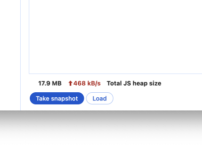

# Components

[TOC]

## Buttons


### Variations

#### Primary buttons

Primary buttons are the most prominent type of button available. They are used for a single, necessary action a developer must complete, or for a highly recommended, promoted action. Use them sparingly and with purpose.
#### Outlined buttons

Outlined buttons are the default button style. Use them for regular actions in the UI or to cancel dialogs.

#### Text buttons
Text buttons are the least prominent button choice. Use them in cases outlined buttons would create too much visual noise.


#### Tonal buttons
Use tonal buttons in dialogs for actions that stand secondary to a primary action and are not a cancel or close action.

#### Icon buttons

Use icon buttons in toolbars of contextual actions that shouldn’t take up much space.

### Usage
#### Developer guidelines
##### Dos
* Use [`devtools-button`](https://source.chromium.org/chromium/chromium/src/+/main:third_party/devtools-frontend/src/front_end/ui/components/buttons/Button.ts) for Primary, Outlined, Text and Icon buttons
* Use [`ToolbarButton`](https://source.chromium.org/chromium/chromium/src/+/main:third_party/devtools-frontend/src/front_end/ui/legacy/Toolbar.ts;drc=2017cd8a8925f180257662f78eaf9eb93e8e394d;bpv=1;bpt=1;l=555?q=toolbar.ts%20devtools&ss=chromium&gsn=ToolbarButton&gs=KYTHE%3A%2F%2Fkythe%3A%2F%2Fchromium.googlesource.com%2Fcodesearch%2Fchromium%2Fsrc%2F%2Fmain%3Flang%3Dtypescript%3Fpath%3Dfront_end%2Fui%2Flegacy%2FToolbar%23ToolbarButton%2523type) for buttons inside [`Toolbars`](https://source.chromium.org/chromium/chromium/src/+/main:third_party/devtools-frontend/src/front_end/ui/legacy/Toolbar.ts). Underneath they make use of `devtools-button`.


##### Don'ts
* Use `<button>`, as they are not styled correctly
* Change the default color of icons (only in exceptions)

##### Developer examples

###### Primary button
Usage within HTML environment:

```html
<devtools-button
      class="some-class"
      .variant=${Buttons.Button.Variant.PRIMARY}
                 .title=${i18nString(UIStrings.someString)}
      .jslogContext=${'some-context')
      @click=${handleClick()}
      )></devtools-button>
```

Usage within Typescript environment (mostly when working with legacy code):

```ts
  const button = new Buttons.Button.Button();
  button.data = {
      variant: Buttons.Button.Variant.PRIMARY,
      title: i18nString(UIStrings.someString),
      jslogContext: 'some-context',
    };
  button.classList.add(‘some-class’);
  button.addEventListener(‘click’, () => handleClick());

```
###### Outlined button
###### Text button
###### Icon button

#### Design guidelines
##### Dos
 
 * **Confirmation dialogs**: buttons that complete a flow.
  These buttons highlight the actions a developer needs to take to finish a
  task (e.g., "Delete" to remove a file or "Submit" to finalize a form).
  When used in a dialog, always place the primary button on the right side.

 
 * **Required actions**: use the primary button for actions the developer
   must take every time to use a panel's functionality. Examples include "Start Recording" or "Run Audit."

##### Don'ts
 
 * **Avoid multiple primary buttons**: avoid using more than one primary button on a single UI surface. If you have multiple important actions, use outlined buttons.

### Common use cases

### Resources

#### For developers
##### Link to implementation
* [`devtools-button`](https://source.chromium.org/chromium/chromium/src/+/main:third_party/devtools-frontend/src/front_end/ui/components/buttons/Button.ts)

#### For designers

##### Deep link into Figma
* [Buttons](https://www.figma.com/design/A5iQBBNAe5zPFpJvUzUgW8/CDT-design-kit?node-id=481-2167&m=dev)
* [Icon buttons](https://www.figma.com/design/A5iQBBNAe5zPFpJvUzUgW8/CDT-design-kit?node-id=571-616&m=dev)

##### Color tokens

## Dialogs and Toasts

## Checkboxes


